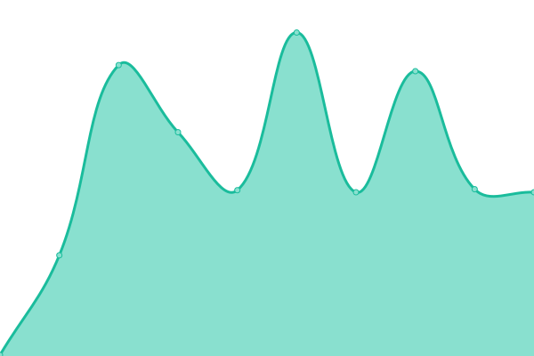
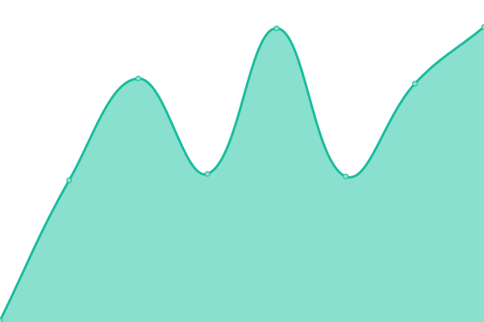

# [📈 Live Status](https://status.joshyb.xyz): <!--live status--> **🟩 All systems operational**

This repository contains the open-source uptime monitor and status page for my public services, powered by [Upptime](https://github.com/upptime/upptime).

With [Upptime](https://upptime.js.org), you can get your own unlimited and free uptime monitor and status page, powered entirely by a GitHub repository. We use [Issues](https://github.com/yojoshb/status/issues) as incident reports, [Actions](https://github.com/yojoshb/status/actions) as uptime monitors, and [Pages](https://status.joshyb.xyz) for the status page.

<!--start: status pages-->
<!-- This summary is generated by Upptime (https://github.com/upptime/upptime) -->
<!-- Do not edit this manually, your changes will be overwritten -->
<!-- prettier-ignore -->
| URL | Status | History | Response Time | Uptime |
| --- | ------ | ------- | ------------- | ------ |
|  Plex Media Server | 🟩 Up | [plex-media-server.yml](https://github.com/yojoshb/status/commits/HEAD/history/plex-media-server.yml) | 

 97ms
     
 | 

<a href="https://status.joshyb.xyz/history/plex-media-server">99.51%</a>
    

|  Ombi | 🟩 Up | [ombi.yml](https://github.com/yojoshb/status/commits/HEAD/history/ombi.yml) | 

 267ms
     
 | 

<a href="https://status.joshyb.xyz/history/ombi">100.00%</a>
    

|  Mealie | 🟩 Up | [mealie.yml](https://github.com/yojoshb/status/commits/HEAD/history/mealie.yml) | 

 182ms
     
 | 

<a href="https://status.joshyb.xyz/history/mealie">100.00%</a>
    

|  Files | 🟩 Up | [files.yml](https://github.com/yojoshb/status/commits/HEAD/history/files.yml) | 

 184ms
     
 | 

<a href="https://status.joshyb.xyz/history/files">100.00%</a>
    

|  Vault | 🟩 Up | [vault.yml](https://github.com/yojoshb/status/commits/HEAD/history/vault.yml) | 

 174ms
     
 | 

<a href="https://status.joshyb.xyz/history/vault">100.00%</a>
    

|  Guacamole | 🟩 Up | [guacamole.yml](https://github.com/yojoshb/status/commits/HEAD/history/guacamole.yml) | 

 181ms
     
 | 

<a href="https://status.joshyb.xyz/history/guacamole">100.00%</a>
    

<!--end: status pages-->

[**Visit the status website →**](https://status.joshyb.xyz)

## 📄 License

- Powered by: [Upptime](https://github.com/upptime/upptime)
- Code: [MIT](./LICENSE) © [yojoshb](https://status.joshyb.xyz)
- Data in the `./history` directory: [Open Database License](https://opendatacommons.org/licenses/odbl/1-0/)
