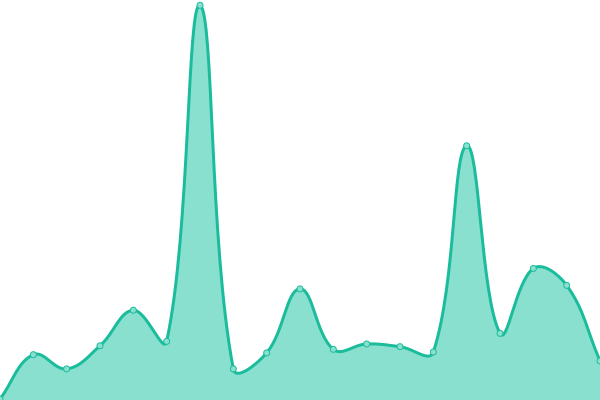

# [📈 Live Status](https://status.joshyb.xyz): <!--live status--> **🟧 Partial outage**

This repository contains the open-source uptime monitor and status page for [my public domain](https://status.joshyb.xyz), powered by [Upptime](https://github.com/upptime/upptime).

With [Upptime](https://upptime.js.org), you can get your own unlimited and free uptime monitor and status page, powered entirely by a GitHub repository. We use [Issues](https://github.com/yojoshb/status/issues) as incident reports, [Actions](https://github.com/yojoshb/status/actions) as uptime monitors, and [Pages](https://status.joshyb.xyz) for the status page.

<!--start: status pages-->
<!-- This summary is generated by Upptime (https://github.com/upptime/upptime) -->
<!-- Do not edit this manually, your changes will be overwritten -->
<!-- prettier-ignore -->
| URL | Status | History | Response Time | Uptime |
| --- | ------ | ------- | ------------- | ------ |
|  [Plex](https://www.plex.tv/) | 🟩 Up | [plex.yml](https://github.com/yojoshb/status/commits/HEAD/history/plex.yml) | 

 101ms
     
 | 

<a href="https://status.joshyb.xyz/history/plex">100.00%</a>
    

|  [Ombi](https://ombi.joshyb.xyz) | 🟩 Up | [ombi.yml](https://github.com/yojoshb/status/commits/HEAD/history/ombi.yml) | 

 202ms
     
 | 

<a href="https://status.joshyb.xyz/history/ombi">100.00%</a>
    

|  [Wiki](https://wiki.joshyb.xyz) | 🟩 Up | [wiki.yml](https://github.com/yojoshb/status/commits/HEAD/history/wiki.yml) | 

 538ms
     
 | 

<a href="https://status.joshyb.xyz/history/wiki">100.00%</a>
    

|  [Valheim Server (Kingdom Kum)](https://valheim.joshyb.xyz) | 🟩 Up | [valheim-server-kingdom-kum.yml](https://github.com/yojoshb/status/commits/HEAD/history/valheim-server-kingdom-kum.yml) | 

 192ms
     
 | 

<a href="https://status.joshyb.xyz/history/valheim-server-kingdom-kum">100.00%</a>
    

|  [Valheim Server (Hall and Oaks)](https://valheim2.joshyb.xyz) | 🟩 Up | [valheim-server-hall-and-oaks.yml](https://github.com/yojoshb/status/commits/HEAD/history/valheim-server-hall-and-oaks.yml) | 

 185ms
     
 | 

<a href="https://status.joshyb.xyz/history/valheim-server-hall-and-oaks">100.00%</a>
    

|  [Minecraft Server](https://mc.joshyb.xyz) | 🟥 Down | [minecraft-server.yml](https://github.com/yojoshb/status/commits/HEAD/history/minecraft-server.yml) | 

 113ms
     
 | 

<a href="https://status.joshyb.xyz/history/minecraft-server">100.00%</a>
    

<!--end: status pages-->

[**Visit the status website →**](https://status.joshyb.xyz)

## 📄 License

- Powered by: [Upptime](https://github.com/upptime/upptime)
- Code: [MIT](./LICENSE) © [yojoshb](https://status.joshyb.xyz)
- Data in the `./history` directory: [Open Database License](https://opendatacommons.org/licenses/odbl/1-0/)
